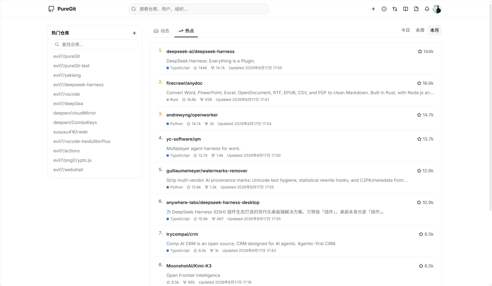
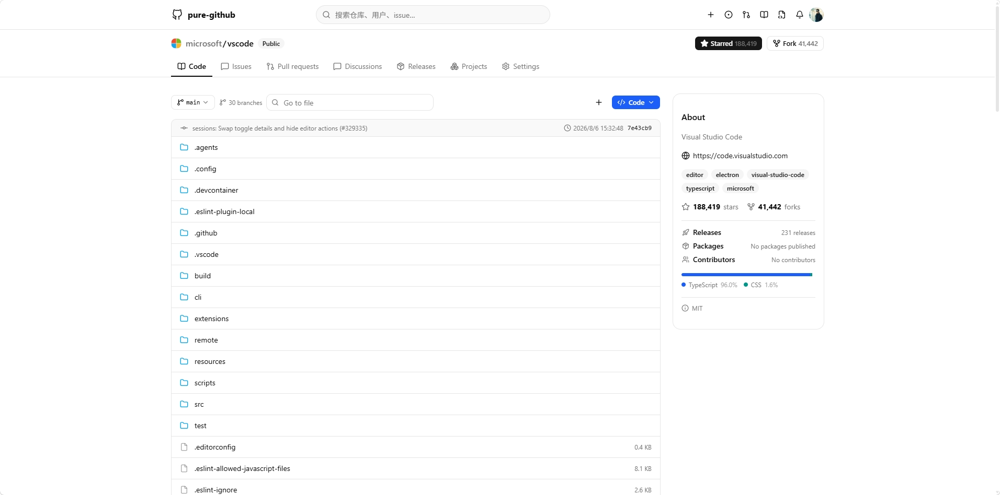
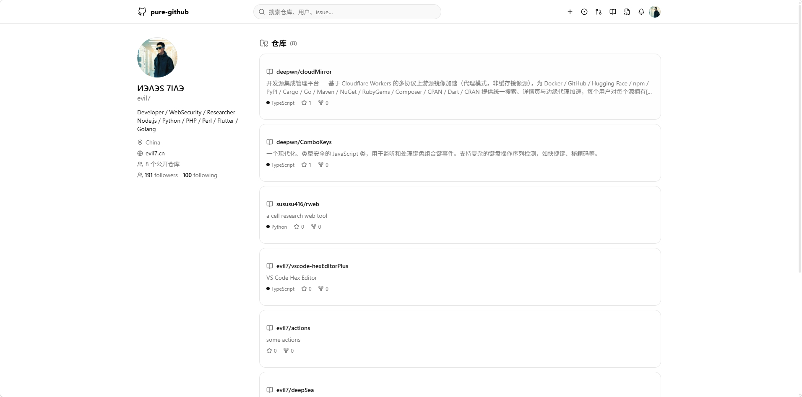
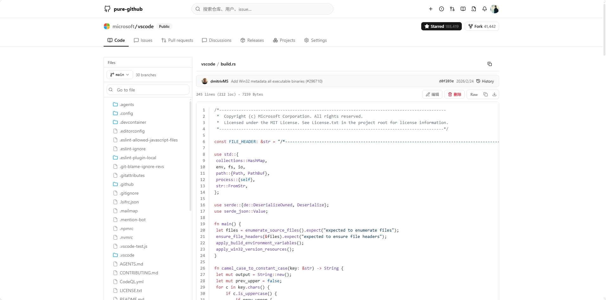

<div align="center">

# PureGit

**通过 GitHub 官方 API 全量复刻的 GitHub 前端 —— 功能对齐官方、界面干净简洁**


---

> 全量复刻、干净呈现、回归本源 😄

</div>

> [!TIP] 
> 
> **本项目由「deepseek-v4-flash」完全托管开发**，项目结构与文档对 vibe coding 友好，具备完整设计规范（Design System）、架构文档、Copilot 指令与开发技能（Skills），Agent 可快速理解与上手迭代。
> 
> **版本阶段：v0.0.1 全量复刻**——由「简版 GitHub」升级为「功能对齐官方的全量复刻」；0.0.x 内部试错仍有效，可随时开展破坏性、不兼容的重构与尝试。

## 界面预览

| 首页                               | 代码页                               | 个人主页                                  | 文件浏览                                   |
| ---------------------------------- | ------------------------------------ | ----------------------------------------- | ------------------------------------------ |
|  |  |  |  |

---

## 特性

### 全面复刻 GitHub 核心功能闭环

| 领域     | 能力                                                                                                                                                                        |
| -------- | --------------------------------------------------------------------------------------------------------------------------------------------------------------------------- |
| **浏览** | 首页 Dashboard（动态 Feed + 今日/本周/本月热点）、搜索（仓库/用户/issue）、仓库详情（README 渲染 / 文件树 / 代码高亮 / 语言统计 / About）、用户与组织主页、Releases         |
| **协作** | issue（列表 / 详情 / 创建）、PR（列表 / 详情 / 创建）、star / unstar / fork、**文件在线编辑 / 新增 / 删除**（直接 commit 到分支）                                           |
| **管理** | 个人资料 / 凭据管理 / 邮箱 / 组织 / 仓库管理 / 外观（主题 + 中英双语）、仓库设置（基本信息 / 危险区改名 / 归档 / 迁移 / 删除）、组织设置、**GPG / SSH keys 管理**、通知已读 |
| **身份** | GitHub OAuth2 登录（**只读 / 完全控制** 两档权限 + 真实授予 scope 可视化）、会话恢复                                                                                        |
| **CLI**  | **git 镜像端点自动代理**：`git clone / pull / push` 经 Worker 转发，解决 `github.com` 直连不稳定                                                                            |

### 全量复刻，分批对齐官方

- **功能对齐官方**：以官方页面为基准，按依赖层级 L0→L5 分批复刻——核心闭环（浏览/协作/账户/CLI）已完成，深度功能（评审工作流 / Webhooks / Packages / Pages / 深度安全子页）分批纳入路线图
- 页面干净整洁：统一布局系统（Design System）、组件优先 shadcn/ui、信息密度适中——**简约仅限前端呈现，不限功能范围**
- 技术化简：**Octokit SDK 统一封装 + 用户可选主模式**（GraphQL 优先 / REST 优先，双额度自动冗余，页面不感知协议）
- 开发辅助：**API 对照索引 / 页面分类索引**内部工具（`scripts/` + `scripts/data/*.json`）——查接口、查页面、查双端点冗余候选用工具，不靠记忆

---

## 技术栈

| 层     | 技术                                                                                                    |
| ------ | ------------------------------------------------------------------------------------------------------- |
| 前端   | React 19 · Vite · TypeScript · Tailwind CSS 4 · shadcn/ui · react-i18next · CodeMirror 6 代码高亮       |
| 数据源 | GitHub **GraphQL** + **REST**（Octokit SDK 统一封装，用户可选主模式、双额度自动冗余），请求直连官方 API |
| 后端   | Cloudflare Pages Worker（OAuth2 令牌管理 + KV 会话 + 系统代理 wiki/raw + CLI git 镜像代理）             |
| 工程   | pnpm workspace · vitest · oxlint · oxfmt                                                                |

---

## 快速开始

### 1. 注册 GitHub OAuth App

1. 打开 https://github.com/settings/developers → **New OAuth App**
2. 填写：
   - Application name：`PureGit`
   - Homepage URL：`http://localhost:5173`
   - Authorization callback URL：`http://localhost:5173/$auth/callback`
3. 复制生成的 **Client ID** 与 **Client Secret**

### 2. 安装依赖

```bash
pnpm install
```

### 3. 配置 Worker 环境变量

```bash
# 从模板复制（worker/.dev.vars 已被 .gitignore 忽略，勿提交）
copy worker/.dev.vars.example worker/.dev.vars
```

`worker/.dev.vars` 需要 4 个变量（本地值，与 vite dev 端口 127.0.0.1:5173 严格同步）：

```bash
GITHUB_CLIENT_ID=<你的 Client ID>
GITHUB_CLIENT_SECRET=<你的 Client Secret>
GITHUB_OAUTH_CALLBACK=http://127.0.0.1:5173/$auth/callback
FRONTEND_URL=http://127.0.0.1:5173
```

> GitHub OAuth App 的 **Authorization callback URL** 必须与此处的 `GITHUB_OAUTH_CALLBACK` 精确一致。

### 4. 启动开发（前端 + Worker 单进程）

```bash
pnpm dev
```

打开 `http://localhost:5173`，点击右上角「登录」即可。

---

## CLI 集成（git 镜像代理）

一行配置，让本机 git 将 GitHub 流量自动代理到 Worker 镜像端点：

```bash
git config --global url.https://<你的worker域名>/.insteadOf https://github.com/
```

之后 `git clone` / `git pull` / `git push` 全部自动走镜像；push 使用 **PAT** 作 git 凭据即可（Worker 原样透传，不存储）。

> 详细说明见 [docs/cli-setup.md](./docs/cli-setup.md)

---

## 部署（Cloudflare Workers）

```bash
# 1. 基于模板生成你的部署配置（仓库自带的 wrangler.jsonc 为原作者生产配置）
copy worker/wrangler.jsonc.example worker/wrangler.jsonc

# 2. 创建 KV namespace（用于会话存储），将输出的 id 填入 wrangler.jsonc
pnpm --filter worker kv:create

# 3. 配置生产 Secret（仅 Worker 端持有，前端零密钥）
cd worker
wrangler secret put GITHUB_CLIENT_SECRET

# 4. 修改 wrangler.jsonc 的 vars 为生产域名（见下）
# 5. 部署（根目录 pnpm deploy 会自动先构建前端再部署 Worker）
pnpm deploy
```

**部署前必须修改** `worker/wrangler.jsonc`（参考 `worker/wrangler.jsonc.example`）：

```jsonc
"vars": {
  "GITHUB_CLIENT_ID": "<你的 Client ID>",
  "GITHUB_OAUTH_CALLBACK": "https://<你的域名>/$auth/callback",
  "FRONTEND_URL": "https://<你的域名>"
}
```

- 不用自定义域名时，**删除 `routes` 块**（默认 `<项目名>.<账户>.workers.dev` 即可）
- 使用自定义域名时，将 `routes` 与上面两个 URL 替换为你自己的域名
- 同时把 GitHub OAuth App 的 **Authorization callback URL** 改为 `https://<你的域名>/$auth/callback`

> 前端镜像 clone 命令的地址会自动取当前访问域名（`window.location.host`），无需额外配置。

---

## 文档

| 文档                                           | 内容                            |
| ---------------------------------------------- | ------------------------------- |
| [docs/vision.md](./docs/vision.md)             | 中心思想与产品定位（v0.0.1 全量复刻）      |
| [docs/design.md](./docs/design.md)             | UI/UX 设计规范（Design System） |
| [docs/architecture.md](./docs/architecture.md) | 架构设计                        |
| [docs/api-compat.md](./docs/api-compat.md)     | API 兼容性对照表单与实施指导    |
| [docs/cli-setup.md](./docs/cli-setup.md)       | CLI 镜像接入指南                |

> 完整文档体系（公开/内部划分、每个文档的用意/用法/场景）见 [docs/index.md](./docs/index.md)

---

## Agent / vibe coding 支持

本项目在仓库内固化了一整套「Agent 协作设施」，让 AI 编码助手（Copilot / Cursor / Claude Code 等）直接可上手：

- **`.github/copilot-instructions.md`** —— 全局指令（顶层框架：架构红线 / 开发规范 / 文档体系与规则层级 / 构建命令），会话自动加载
- **`.github/prompts/puregit.prompt.md`** —— 会话启动总纲（Chat 输入 `/puregit` 调用）
- **`.github/skills/`** —— 领域技能（OAuth Worker 开发 / git 镜像代理 / shadcn 组件 / UI 布局规范）
- **`docs/index.md`** —— 文档体系总导航（每个文档的真实用意 / 使用方式 / 适用场景）
- **`docs/design.md`** —— 完整 UI/UX Design System（框架层级 / 组件定义 / 响应式 / 验收清单）

> 想参与开发？直接对 Agent 提出需求即可，它会自动加载全局指令 → 读文档导航 → 按规范动手，并保持代码与文档同步。

---

## License

 MIT

---

## 说明

- 用户浏览器前端直接与 GitHub API 产生数据交换，因此请 **遵循官方 [GitHub Terms of Service](https://docs.github.com/en/site-policy/github-terms/github-terms-of-service) 准则**，勿产生任何违反官方条款的行为
- 推荐部署在 Cloudflare Workers（免费额度供个人使用足矣），Worker 端仅做 OAuth2 令牌管理 + KV 会话管理，远端 **不存储任何用户数据**
- 边缘业务因无 API 支持，本项目仅设计做**镜像转发**，自行部署使用时可通过 ENV 关闭 Worker 转发代理
- 本项目**仅供学习与研究使用**，与 GitHub 官方无任何隶属关系