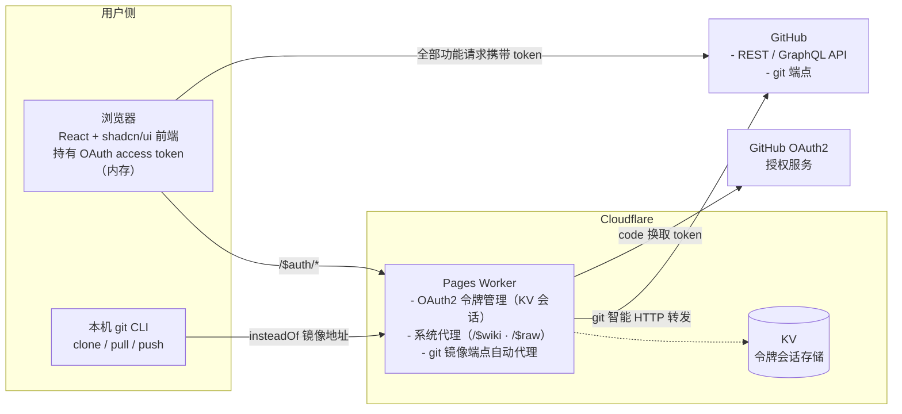

# PureGit 架构设计

> **中心思想**：全量复刻 GitHub 前端（详见 [vision.md](./vision.md)）。本架构服务于该定位——前端承载全部业务，Worker 只做身份与 CLI 代理，数据一律来自官方 API。

## 总体架构



## 组件职责边界

### 前端（`web/`，React + Vite + TS + shadcn/ui）

- 纯 UI 与交互，无业务后端逻辑；全部功能（浏览、搜索、issue/PR、star/fork、私有仓库）均由 OAuth **access token** 完成，请求**直连 GitHub API**；未登录时公开数据匿名直连
- **API 策略**：Octokit SDK 统一封装（`@octokit/graphql` + `@octokit/rest`）；**登录态强制 GraphQL 唯一主通道**（唯一例外 = GraphQL 无适配），smart 函数 = GraphQL 请求模板 + 路径参数变量；**GraphQL 失败 → `withRestFallback` 熔断降级 REST**；**匿名强制 REST**（GraphQL 匿名恒 403）
- **登录态**：token 仅存**内存变量**（刷新经 Worker `/$auth/session` 恢复）；**不写入 localStorage 明文**
- **路由架构（data router）**：`createBrowserRouter` + `RouterProvider`，根 layout 携带 `errorElement` 分类渲染全局错误页（404/限流/5xx）；局部区块错误用 `InlineError`
- **权限体系（双层）**：① **令牌级**（`useAuth`）——`canWrite`（登录 scope 是否「完全控制」模式）及各 scope 维度，由 `WriteGate`/`PermissionGate` 承担门控；② **仓库级**（`useRepoPermission`）——读 repo context 的 `viewer_permission`（ADMIN > MAINTAIN > WRITE > TRIAGE > READ）派生 `canCollaborate`/`canWrite`/`canAdmin` 三档。**写操作双门槛叠加**；匿名/未登录 → 三档全 false（只读浏览）
- **布局**：所有多栏页面统一用 `PageLayout`（三栏模型，left/right 可选）+ 共享常量 `web/src/lib/layout.ts`；组件一律复用 shadcn/ui

### Worker（`worker/`，Cloudflare Pages Worker）

| 职责 | 说明 |
| --- | --- |
| OAuth2 令牌管理 | `/$auth/*` 系列：登录跳转、回调换 token、PAT 直接登录、会话恢复/登出/列表/撤销；`client_secret` 仅存 Worker Secret |
| 会话存储（KV） | access token 存 KV（键 = 会话 id），前端持 httpOnly cookie（会话 id）；会话 TTL 有限期 |
| git 镜像端点自动代理 | 接收 git CLI 流量（info/refs、upload-pack、receive-pack），自动转发至 GitHub 对应端点，支持 clone/pull/push |
| Wiki 内容代理 | `/$wiki/{owner}/{repo}/{page}` —— 服务端 fetch raw wiki（GitHub API 无 wiki 通道，前端直连 raw 受限 → worker 代理） |
| Raw 内容代理 | `/$raw/{owner}/{repo}/{ref}/{path...}` —— 服务端 fetch raw.githubusercontent.com，README 图片/资源降级通道 |

**系统路由优先级**：`/$auth`、`/$wiki`、`/$raw`、`/$healthz`、git 端点优先于用户级通配 `/:owner/:repo`；`$` 前缀（GitHub 用户名/仓库名不含 `$`）永不被用户路由占用。**`/$debug` 为纯前端路由**（worker 不参与）。

### CLI 接入（git 镜像端点自动代理）

用户执行一次配置，使本机 git 将 GitHub 地址替换为镜像端点：

```bash
git config --global url.https://<worker域名>/.insteadOf https://github.com/
```

之后 `git clone https://github.com/owner/repo.git` 实际请求 `https://<worker域名>/owner/repo.git`，由 Worker **自动代理**转发到 GitHub。git 凭据使用 **Personal Access Token（PAT）**（push 需要；只读公开仓库无需凭据）。接入细节见 [cli-setup.md](./cli-setup.md)。

## API 模式（登录强制 GraphQL 唯一主通道 + 匿名强制 REST + 熔断降级）

- **GraphQL 唯一主通道**：登录态全部功能经 GraphQL；无「REST 优先」模式选项。路径参数不做字符串拼查询，统一映射为 GraphQL 模板变量
- **匿名强制 REST**（硬约束非降级）：GraphQL 匿名恒 403，匿名时 smart 层短路走 REST 数据层
- **熔断降级**：GraphQL 不可用（网络错误/业务错误/超时/额度耗尽）→ `withRestFallback` 降级链复用 REST 层，日志 `↪` 标记
- **实现载体**：`octokit.ts`（SDK 统一入口 + 额度跟踪 + 熔断）、`api-core.ts`（graphqlRequest + withRestFallback）、`graphql.ts`（模板库）、`api.ts`（smart 封装层）、`rest.ts`（REST 数据层）；页面只调用 `api.ts`，不感知协议

## 关键技术约束

1. **OAuth 回调**：callback URL 指向 Worker（需提前规划开发/生产两套回调）。
2. **令牌管理**：`client_secret` 仅存 Worker Secret；access token 由 Worker 换取后存 KV；**PAT 直接登录**（GitHub 主站受限时绕过授权页）；GitHub OAuth 无 refresh token，token 撤销/过期则重新登录。
3. **会话 cookie**：httpOnly cookie 仅存会话 id（非 token 本身），与 KV 键关联；登出删除 KV 键与 cookie。
4. **git 代理协议**：正确透传 info/refs 的 `service=` 参数、Content-Type、Transfer-Encoding；push 鉴权经 PAT 透传。
5. **CORS**：前端直连 GitHub API 依赖其公开 CORS；Worker OAuth/CLI 端点需处理跨域（同域部署可简化）。
