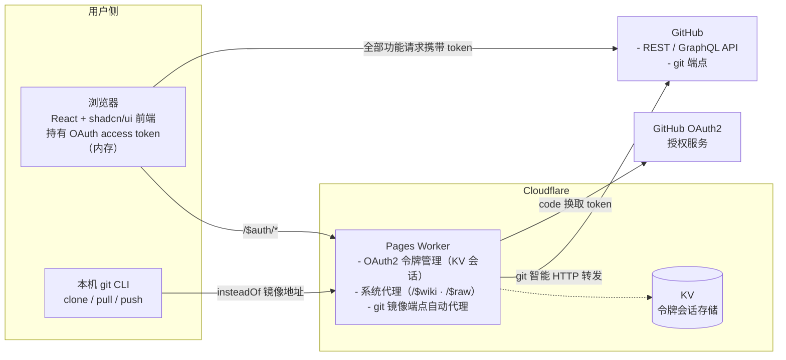
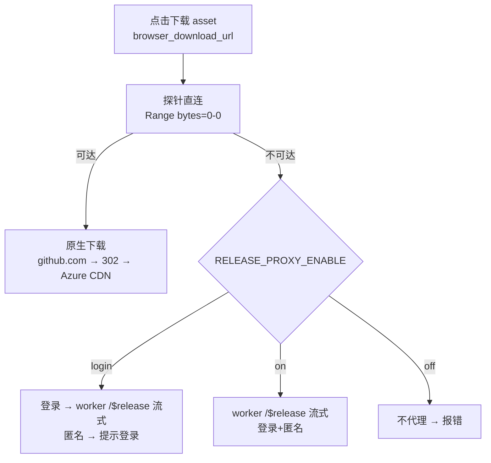

# PureGit 架构设计

> **中心思想**：全量复刻 GitHub 前端（详见 [vision.md](./vision.md)）。本架构服务于该定位——前端承载全部业务，Worker 只做身份与 CLI 代理，数据一律来自官方 API。

## 总体架构



## 组件职责边界

### 前端（`web/`，React + Vite + TS + shadcn/ui）

- 纯 UI 与交互，无业务后端逻辑；全部功能（浏览、搜索、issue/PR、star/fork、私有仓库）均由 OAuth **access token** 完成，请求**直连 GitHub API**；未登录时公开数据匿名直连
- **API 策略**：Octokit SDK 统一封装（登录态 GraphQL 唯一主通道 + 匿名强制 REST + 熔断降级），详见下方「API 模式」章节
- **登录态**：token 仅存**内存变量**（刷新经 Worker `/$auth/session` 恢复）；**不写入 localStorage 明文**
- **路由架构（data router）**：`createBrowserRouter` + `RouterProvider`，根 layout 携带 `errorElement` 分类渲染全局错误页（404/限流/5xx）；局部区块错误用 `InlineError`
- **权限体系（双层）**：① **令牌级**（`useAuth`）——`canWrite`（登录 scope 是否「完全控制」模式）及各 scope 维度，由 `WriteGate`/`PermissionGate` 承担门控；② **仓库级**（`useRepoPermission`）——读 repo context 的 `viewer_permission`（ADMIN > MAINTAIN > WRITE > TRIAGE > READ）派生 `canCollaborate`/`canWrite`/`canAdmin` 三档。**写操作双门槛叠加**；匿名/未登录 → 三档全 false（只读浏览）
- **布局**：统一 `PageLayout`（三栏模型）+ 共享常量 `web/src/lib/layout.ts` + shadcn/ui，详见 `design.md`

### Worker（`worker/`，Cloudflare Pages Worker）

| 职责 | 说明 |
| --- | --- |
| OAuth2 令牌管理 | `/$auth/*` 系列：登录跳转、回调换 token、PAT 直接登录、会话恢复/登出/列表/撤销；`client_secret` 仅存 Worker Secret |
| 会话存储（KV） | access token 存 KV（键 = 会话 id），前端持 httpOnly cookie（会话 id）；会话 TTL 有限期 |
| git 镜像端点自动代理 | 接收 git CLI 流量（info/refs、upload-pack、receive-pack），自动转发至 GitHub 对应端点，支持 clone/pull/push |
| Wiki 内容代理 | `/$wiki/{owner}/{repo}/{page}` —— 服务端 fetch raw wiki（GitHub API 无 wiki 通道，前端直连 raw 受限 → worker 代理） |
| Raw 内容代理 | `/$raw/{owner}/{repo}/{ref}/{path...}` —— **统一入口智能路由**：登录透传 raw / api blob / 302；匿名 api blob / 302；受 `RAW_PROXY_ENABLE` 控制透传（见「Raw 内容通道」章节） |
| Release 内容代理 | `/$release/{owner}/{repo}/download/{tag}/{asset}` —— 服务端 fetch github.com release 二进制（302 跟随签名 CDN），**流式透传不缓存**；受 `RELEASE_PROXY_ENABLE` 开关控制（见「Release 内容通道」章节） |

**系统路由优先级**：`/$auth`、`/$wiki`、`/$raw`、`/$release`、`/$healthz`、git 端点优先于用户级通配 `/:owner/:repo`；`$` 前缀（GitHub 用户名/仓库名不含 `$`）永不被用户路由占用。**`/$debug` 为纯前端路由**（worker 不参与）。

### CLI 接入（git 镜像端点自动代理）

用户执行一次配置，使本机 git 将 GitHub 地址替换为镜像端点：

```bash
git config --global url.https://<worker域名>/.insteadOf https://github.com/
```

之后 `git clone https://github.com/owner/repo.git` 实际请求 `https://<worker域名>/owner/repo.git`，由 Worker **自动代理**转发到 GitHub。git 凭据使用 **Personal Access Token（PAT）**（push 需要；只读公开仓库无需凭据）。接入细节见 [cli-setup.md](./cli-setup.md)。

## API 模式（登录强制 GraphQL 唯一主通道 + 匿名强制 REST + 熔断降级）

- **GraphQL 唯一主通道**：登录态全部功能经 GraphQL；无「REST 优先」模式选项。路径参数不做字符串拼查询，统一映射为 GraphQL 模板变量
- **文件内容读取例外**：文件原始内容（blob 页 / 编辑页 / DiffView Expand）**去 GraphQL 走 REST contents API**（登录带 token / 匿名不带，前端直发）；`/$raw` 仅作为登录态私有仓库 / 大文件的**透传加速**（worker 纯反代 raw.githubusercontent.com）。文件头 commit 信息仍走 GraphQL（Commit.history 无 1MB 限制）。详见「Raw 内容通道」章节
- **匿名强制 REST**（硬约束非降级）：GraphQL 匿名恒 403，匿名时 smart 层短路走 REST 数据层
- **熔断降级**：GraphQL 不可用（网络错误/业务错误/超时/额度耗尽）→ `withRestFallback` 降级链复用 REST 层，日志 `↪` 标记
- **实现载体**：`octokit.ts`（SDK 统一入口 + 额度跟踪 + 熔断）、`api-core.ts`（graphqlRequest + withRestFallback）、`graphql.ts`（模板库）、`api.ts`（smart 封装层）、`rest.ts`（REST 数据层）；页面只调用 `api.ts`，不感知协议

## Raw 内容通道（$raw 纯反代）设计

> 本节固化文件内容读取（blob 页 / Raw / 下载 / README 资源）的**通道编排**。
> 中心思想：**`$raw` 仅代表 worker 纯反代**（透传 raw.githubusercontent.com，
> 受 RAW_PROXY_ENABLE 门控）；**获取文件内容由前端直发 API**（登录带 token / 匿名不带），
> 符合「匿名强制 REST」红线——匿名额度按用户自己 IP 计，不再被 worker 出口 IP 共享。

### 1. 通道分流（前端）

文本内容读取（`fetchFileContentSmart`）按 proxy 模式分流：

| 条件 | 通道 | 说明 |
|---|---|---|
| proxy `on` / `login`+已登录 | `/$raw` 透传 | worker 带 token 流式透传 raw，私有仓库可读 |
| 其余（`off` / `login`+匿名） | REST contents API | 前端直发 `Accept: raw`，登录带 token / 匿名不带 |

- 媒体/下载 URL（``/`<audio>`/`<video>`/Raw/下载）：proxy 可用 → `/$raw`；否则 → raw.githubusercontent.com 直连（公开库）。
- 内联渲染上限 1MB（`BLOB_INLINE_MAX_BYTES`）：读 body 前按 `Content-Length` 拦截，超限抛 413 → banner「文件过大」。
- 媒体文件（图片/音频/视频）blob 页不读文本，直接 `/<audio>/<video>`；SVG 走代码渲染（安全）。

### 2. worker 端（纯透传 + 鉴权门控）

- `/$raw` 仅做流式透传 raw.githubusercontent.com（带会话 token，私有仓库可读）。
- 鉴权门控 `requireProxyAuth`（off=403 / login=匿名 401 / on=全放），与 `/$wiki` 一致。
- 分级限流（匿名 IP 120/分；登录 600/分）。
- 流式透传（不 arrayBuffer）避免 128MB 内存上限；`/$release` 共用同一直传内核。

### 3. 反代开关 `RAW_PROXY_ENABLE`（off / login / on）

| ENV | 登录透传 | 匿名透传 | 语义 |
|:---:|:---:|:---:|:---|
| `off` | ❌ | ❌ | 不提供透传（登录/匿名都直发 API） |
| `login` | ✅ | ❌ | 仅登录透传——**默认** |
| `on` | ✅ | ✅ | 全部透传 |

### 4. 运行状态可观测（footer 通道状态灯）

footer 右侧状态灯实时反映「最近一次请求实际命中的服务通道」：文件内容读取命中 `/$raw`
时前端报 `worker`，直发 REST contents 时按 REST 通道计数。

## Release 内容通道（$release 后端）设计

> release 资产下载（`browser_download_url`）与 raw 的本质差异：**release 无 jsDelivr 等价公开 CDN**
> （jsDelivr `/gh/` 只镜像源码不镜像 release 二进制），只有「直连」或「worker 反代」两条路。

### 1. 下载链路（探针直连优先 + 熔断代理）



- **探针（probeUrlReachable）**：`Range: bytes=0-0` 只取 0 字节判断可达性（被墙/超时/非 2xx → 不可达），
  替代隐藏 iframe（iframe 拿不到明确状态码与超时）。
- **原生下载（triggerNativeDownload）**：`<a download>` 触发浏览器原生下载（自带进度条），不 fetch 大文件到内存。
- **熔断**：不可达 → 按 `RELEASE_PROXY_ENABLE` 决定 worker `/$release`（流式透传，登录透传 token）。

### 1.1 上传链路（REST 直连 uploads.github.com + 代理降级）

release 资产上传走 `uploads.github.com`（release `upload_url` 模板派生，非 api.github.com），受限网络下
该域名可能不通 → 前端 `uploadReleaseAsset`（smart）直连失败时降级 Worker 上传代理：

- **直连**：octokit `repos.uploadReleaseAsset` POST uploads.github.com（前端带 token）。
- **降级判定**：仅网络层错误（fetch failed / 超时）触发代理；4xx/5xx 业务错误不降级直接抛。
- **代理上传**：`/$release/{owner}/{repo}/upload/{release_id}?name=...` 登录专属（session token 透传
  Authorization），body 流式透传（`request.body` 直传，不 arrayBuffer，避免大文件占 128MB 内存），
  上游响应为 JSON（201 成功 / 4xx 失败）可 buffer。
- 大小防护：Content-Length 预判 ≤2GiB（同下载）。门控与限流同下载（`RELEASE_PROXY_ENABLE` 三段式）。

### 2. 反代开关 `RELEASE_PROXY_ENABLE`（off / login / on）

与 `RAW_PROXY_ENABLE` 解耦（release 二进制 ≤2GiB、匿名刷量风险更高，独立管控），默认 **`login`**：

| ENV | 登录 worker 兜底 | 匿名 worker 兜底 | 语义 |
|:---:|:---:|:---:|:---|
| `off` | ❌ | ❌ | 完全关闭反代 |
| `login` | ✅ | ❌ | 仅登录用户可用——**默认** |
| `on` | ✅ | ✅ | 全部放行 |

- release 资产**不缓存**（immutable 但命中率低、占 512MB 缓存配额）。
- 大小防护：Content-Length 预判 ≤2GiB（GitHub release asset 硬上限）；无 CL 直接透传。
- 超时：**不设超时**（wall time 无限制，流式传输持续活动，避免大文件下载被 30s 掐断）。

## 关键技术约束

1. **OAuth 回调**：callback URL 指向 Worker（需提前规划开发/生产两套回调）。
2. **令牌管理**：`client_secret` 仅存 Worker Secret；access token 由 Worker 换取后存 KV；**PAT 直接登录**（GitHub 主站受限时绕过授权页）；GitHub OAuth 无 refresh token，token 撤销/过期则重新登录。
3. **会话 cookie**：httpOnly cookie 仅存会话 id（非 token 本身），与 KV 键关联；登出删除 KV 键与 cookie。
4. **git 代理协议**：正确透传 info/refs 的 `service=` 参数、Content-Type、Transfer-Encoding；push 鉴权经 PAT 透传。
5. **CORS**：前端直连 GitHub API 依赖其公开 CORS；Worker OAuth/CLI 端点需处理跨域（同域部署可简化）。
6. **流式透传**：`/$raw` / `/$release` 反代必须流式透传（`new Response(upstream.body)`，不 arrayBuffer）——
   免费版 128MB 内存上限下，大文件（release ≤2GiB）buffer 会 exceedMemory；大小防护仅 Content-Length 预判。
