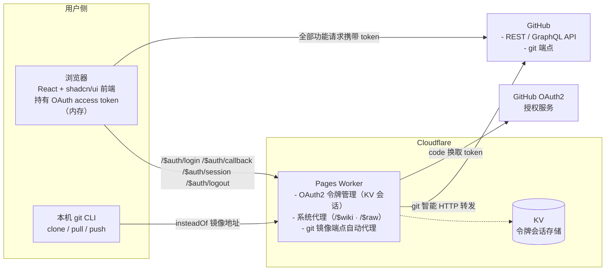
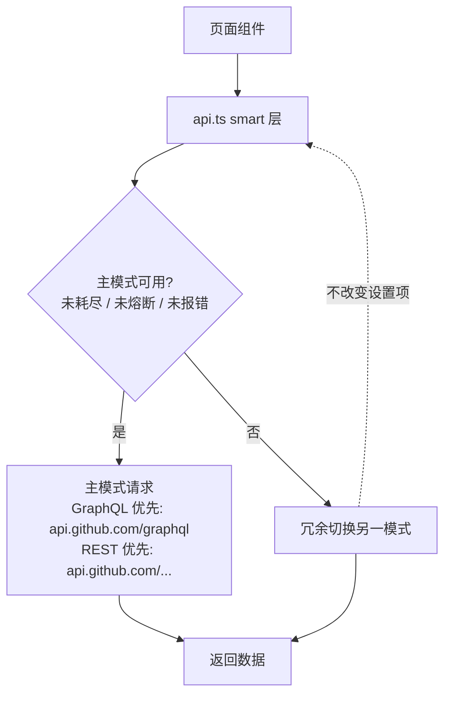
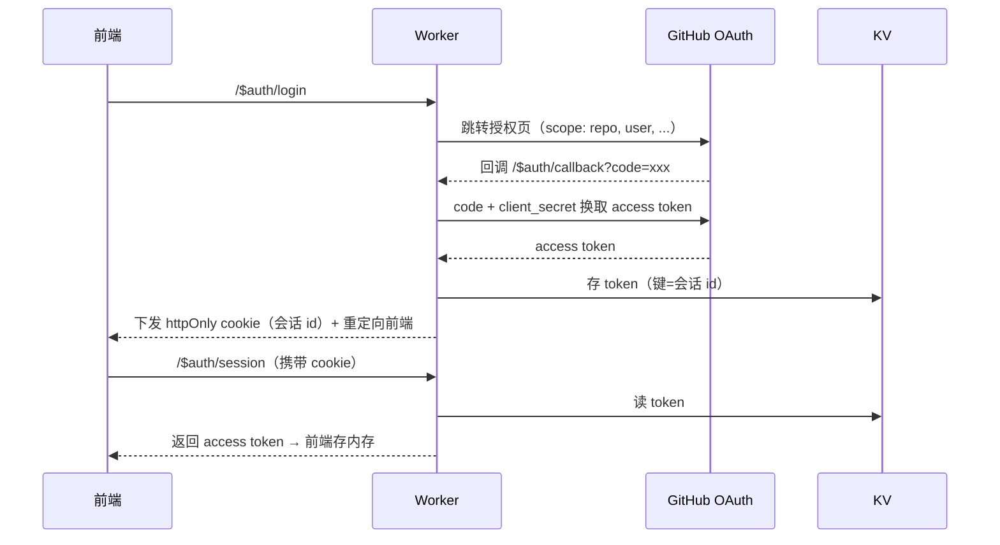
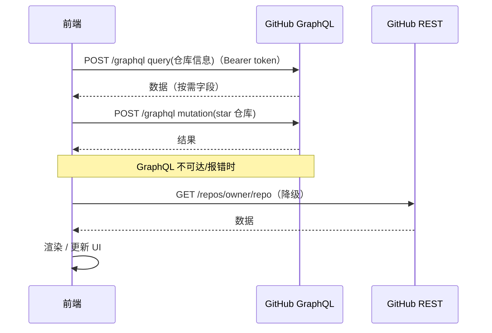
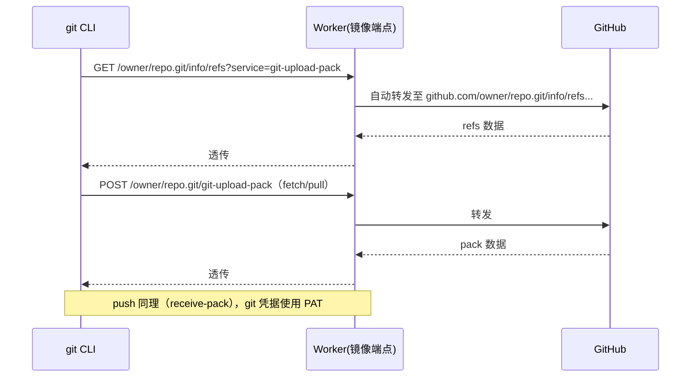

# PureGit 架构设计

> **中心思想**：全面复刻简版 GitHub（详见 [vision.md](./vision.md)）。本架构服务于该定位——前端承载全部业务（浏览/搜索/管理），Worker 只做身份与 CLI 代理，数据一律来自官方 API。

## 总体架构



## 组件职责边界

### 前端（`web/`，React + Vite + TS + shadcn/ui）

- 纯 UI 与交互，无业务后端逻辑
- **全部功能**（浏览、搜索、issue/PR、star/fork、私有仓库）均由 OAuth **access token** 完成，请求**直连 GitHub API**（`Authorization: Bearer <token>`）；未登录时公开数据匿名直连
- **API 策略**：**Octokit SDK 统一封装**（`@octokit/rest` + `@octokit/graphql`，入口 `web/src/lib/octokit.ts`）；**主模式由用户在偏好设置切换**（GraphQL 优先 / REST 优先，默认 GraphQL）；统一经 `web/src/lib/api.ts` 智能封装层（详见下方「API 模式」）
- 登录态：token 仅存**内存变量**（刷新页面后经 Worker `/$auth/session` 恢复）；**不写入 localStorage 明文**
- **未登录访问策略**：仅开放仓库 Code 浏览（根/tree/blob/new/edit）；其余仓库 tab 在 `RepoLayout.RepoContent` 拦截 → LoginPrompt 登录墙（聚光灯指引右上角登录，URL 驱动登录后回落）；About 侧栏同条件隐藏（省匿名配额）。首页/搜索/用户主页保持匿名可浏览。
- **未登录全强制 REST**：GitHub GraphQL 端点匿名请求**恒 403**（实测）；`graphql.ts` 原始 `graphqlRequest` 与 `api-core.ts` smart 层 `graphqlRequest` 均加**匿名守卫**——token 为空直接短路返回 errors → smart 函数自动降级 REST（不消耗配额、不产生 403 噪音），任何调用方（api-*.ts / repo-raw.ts）匿名时**绝不再发 GraphQL**；匿名 REST 配额 60/h 耗尽（403，错误响应无 CORS 头 → 浏览器报 CORS 错误）时，仓库目录页等显示**限流提示**（登录解锁 5000/h），不再误报「目录为空」
- **路由架构（data router）**：`App.tsx` 由 declarative `<BrowserRouter><Routes>` 迁移 **`createBrowserRouter` + `RouterProvider`**（React Router v7 data router）——根 layout route（`AppLayout`：Nav + main/Suspense/Outlet + Footer）携带 **`errorElement={<RouteErrorPage/>}`**；页面级整页致命错误（404/限流/5xx）render 中 throw `ApiError` → 冒泡至 errorElement 分类渲染全局错误页；`path="*"` → `NotFoundPage`（未知路径兜底）。**错误分层**：整页级（仓库/用户/详情/列表页加载失败）→ 全局错误页（`ErrorPages.tsx`：`NotFoundPage`/`RateLimitPage`/`ErrorPage`，`ApiError` 携带 `rawBody/parsed` 供错误页 `<details>` 展开原始 JSON）；局部区块（表单/评论/列表子区）→ `InlineError` + toast
- 使用 shadcn/ui 组件体系，禁止手写重复基础组件
- **仓库页布局**（仿 GitHub 简化版）：RepoHeader 全 tab（**官方顺序**：Code/Issues/Pull requests/Discussions/Actions/Projects/Wiki/Security/Insights/Releases/Settings，Features 开关联动显隐）+ About 右侧栏（描述/语言/star/fork/topics/license）；Code tab 提供树状文件树 + **CodeMirror 6 代码高亮/编辑**（全面迁移，Shiki 移除）
- **删减原则**：去杂项（仅 Packages 不实现；Actions/Security/Insights/Wiki 经用户研讨转已实现，vision.md 修订），回归代码版本管理本源
- **技术限制**：Discussions/Projects 无公开 REST API（仅 GraphQL 需认证）
- **布局（对齐官方 2026 新版 code view）**：内容区 `max-w-7xl`（1280px）；仓库名行 = 头像 + 名称 + Public/Private 标签 + Star/Fork（行最右侧，对应官方 `repo-header-actions`）；tabs 独立一行；blob 页面包屑横跨全宽（左树右内容之上）；代码带行号（CSS counter）+ 文件头显示 branch/commit 信息；操作栏含分支计数（`N branch`）；About 侧栏含 About 标题 + stars/forks 文本统计（无"更新于"）

### 统一布局与滚动规范（sticky 层级体系）

> **完整 UI/UX 规范见 `docs/design.md`（Design System）。** 本节为布局与滚动核心结论。

**锚点**：顶栏 Nav 固定高 `h-14`（56px，含 1px 边框 = 57px），`sticky top-0 z-50`。侧栏 sticky 统一 `top-20`（80px，与 topbar 底留 23px 间隔）；内容内 sticky 栏（blob 面包屑）可贴顶用 `top-14`。

**统一实现**：所有多列页面统一用 `PageLayout`（`web/src/components/PageLayout.tsx`，三栏模型 left/right 可选），底层常量在 `web/src/lib/layout.ts`，**禁止手写散落类名**：

| 设施 | 说明 |
|---|---|
| `PageLayout` | **全站统一多栏布局**（替代 GRID_2COL_*）：`left(可选) + 主内容 + right(可选)`；sticky 三态（nav 纯吸附 / tool 限高内滚 / none 随内容滚动）；断点 md/lg/xl；宽度参数化；`hidden` 动态显隐（blob 折叠树保留 DOM 防重挂载）；`items-start` 内置 |
| `PAGE_SHELL` | `mx-auto max-w-7xl px-4 pt-[23px]` 页面外层容器（顶距 23px = sticky 锚对齐；**禁止 py-\***） |
| `SIDEBAR_STICKY` | `md:sticky md:top-20` 导航型 sticky 侧栏（官方式：超高裁切） |
| `SIDEBAR_STICKY_SCROLL` | `md:sticky md:top-20 md:max-h-[calc(100svh-7rem-1px)] md:overflow-y-auto` 工具型 sticky 侧栏（文件树等内部滚动） |
| `SIDEBAR_STICKY_SCROLL_HEAD` | `md:sticky md:top-25 md:max-h-[calc(100svh-7rem-1px)] md:overflow-y-auto` 内容区内工具型 sticky（blob symbols 面板，对齐操作头） |
| `CONTENT_FILL` | `md:min-h-[calc(100svh-5rem-1px)]` 内容区 min-h（撑满视口剩余；PageLayout 有侧栏时自动加） |
| ~~`GRID_2COL_240/260/280/300`~~ | ⚠️ **已弃用**：由 PageLayout `left` 取代（历史：两栏网格，items-start 内置） |

> ⚠️ 关键坑：① 外层容器禁 `py-*`（滚到底推 sticky）；② sticky 侧栏作 grid item 必须 `items-start`（PageLayout 内置，否则 stretch 拉满 → sticky 失效）；③ 导航型侧栏禁 `max-h+overflow`（嵌套滚动条），仅工具型用 SCROLL。

**页面切换动画**：`main > *` 每次导航重挂载自动播放（0.28s fade + 8px 上移，`index.css`）；仓库 tab 切换用 `RepoContent` 包 `<div key={pathname} className="page-enter">`。

### 前端页面结构地图（复刻 GitHub 心智模型，路径与官方一致）

```
/                      首页（趋势仓库，今日/本周/本月）
/search                搜索（仓库 / 用户 / issue）
/:login              用户主页（官方 github.com/username；替换域名即可访问官方）
/orgs/:org             组织主页（组织资料 + 仓库列表）
/:owner/:repo          仓库页（RepoHeader 全 tab + About 侧栏）
  ├── /                 Code 主页：操作栏（分支选择器+Go to file+Code 克隆）+ 根文件列表 + README
  ├── /tree/:branch/*   目录列表（全宽，面包屑 + 条目）       ← 与 github.com/owner/repo/tree/... 同路径
  ├── /blob/:branch/*   文件预览（左文件树 + 右 CodeMirror 6 只读展示）  ← 与 github.com/owner/repo/blob/... 同路径
  ├── /issues           列表 / /issues/:number 详情 / 创建
  ├── /pulls            列表 / /pulls/:number 详情 / 创建
  ├── /discussions      列表 / /discussions/:number 详情（GraphQL only）
  ├── /releases         列表 / /releases/tag/:tag 详情
  └── /projects         列表（GraphQL only，需 project scope）
/settings              账户设置（左侧导航）
  ├── /profile          个人资料             ├── /organizations   组织
  ├── /account          账号                 ├── /repositories    我的仓库
  ├── /emails           邮箱                 └── /appearance      外观（本地主题）
```

> **路径一致性**：任意 `github.com/owner/repo[/path]` 替换为 `puregit.deepwn.io/owner/repo[/path]` 可访问同级功能页（Q03 已确认域名）。

### Worker（`worker/`，Cloudflare Pages Worker）

| 职责                 | 说明                                                                                                                                                                             |
| -------------------- | -------------------------------------------------------------------------------------------------------------------------------------------------------------------------------- |
| OAuth2 令牌管理      | `/$auth/login` 跳转 GitHub 授权；`/$auth/callback` 用 `client_secret` 换取 access token，写入 KV 并下发会话 cookie；`/$auth/pat` **PAT 直接登录**（GitHub 主站受限时绕过授权页，PAT 验证后存 KV + cookie）；`/$auth/session` 按会话恢复 token 返回前端；`/$auth/logout` 注销；`/$auth/sessions` 会话列表（元数据）；`/$auth/sessions/:id/logout` 本地登出指定设备；`/$auth/revoke` 撤销 OAuth App 授权 |
| 会话存储（KV）       | access token 存 KV（键=会话 id），前端持 httpOnly cookie（会话 id），cookie 与 KV 关联；**TTL 7 天**（安全收紧——GitHub OAuth App token 本身永不过期，但 KV/cookie/expiresAt 统一 7 天，过期需重新授权）                                                                                       |
| git 镜像端点自动代理 | 接收 git CLI 流量（info/refs、upload-pack、receive-pack），**自动转发**至 GitHub 对应端点，支持 `git pull/clone/push`                                                            |
| Wiki 内容代理 | `/$wiki/{owner}/{repo}/{page}` GET——服务端 fetch `raw.githubusercontent.com/wiki/{o}/{r}/{page}.md` 返回 md 文本；**GitHub API 无 wiki 通道**（REST/GraphQL 实测全 404，仅 raw 可达；前端直连 raw 被墙 → worker 代理） |
| Raw 内容代理 | `/$raw/{owner}/{repo}/{ref}/{path...}` GET——服务端 fetch `raw.githubusercontent.com/{o}/{r}/{ref}/{path}`，透传上游 Content-Type；**README 图片/资源降级通道**（前端直连 raw 失败 → onError 自动切 `/$raw`） |
| 代理匿名闸 | `PROXY_ALLOW_ANON` env：`true`（默认）允许匿名使用 `/$wiki`/`/$raw`；`false` 强制登录（未带有效会话 401 `auth_required`）。上游白名单仅 raw.githubusercontent.com（防 SSRF）+ 仅 GET + 15s 超时 |

**系统路由优先级**：系统前缀保留段（`/$auth`、`/$wiki`、`/$raw`、`/$healthz`、git 端点 `owner/repo.git/...`）**优先于**用户级通配 `/:owner/:repo`。`$` 符号前缀：GitHub 用户名/仓库名规范**不含 `$`**（仅字母数字+连字符）→ 系统前缀永不被用户路由占用（`$` 明确标识内部高优先级功能性路由）。**`/$debug` 为纯前端路由**（App.tsx lazy 页，worker 不参与）。判断顺序（`worker/src/index.ts`）：`/$healthz`（无条件探活）→ auth（switch）→ 系统代理（`/$wiki`/`/$raw` 含匿名闸）→ git → 前端静态资源（SPA fallback，`/$debug` 由前端路由接管）。**API 调试工具（`/$debug`）GraphQL schema 双通道**：主通道本地 `web/public/github-graphql.min.json`（由 `scripts/build-graphql-schema.mjs` 从 `docs/github-schema.graphql` 官方快照离线生成，秒加载/匿名可用）→ 刷新按钮带 token 在线 introspection 兜底（仅内存缓存）；驱动左栏 Schema 树（字段可展开返回类型子字段浏览）+ 编辑器智能补全（cm6-graphql）。

### CLI 接入（镜像端点自动代理）

用户执行一次配置，使本机 git 将 GitHub 地址替换为镜像端点：

```bash
git config --global url.https://<worker域名>/.insteadOf https://github.com/
```

之后 `git clone https://github.com/owner/repo.git` 实际请求 `https://<worker域名>/owner/repo.git`，由 Worker **自动代理**转发到 GitHub。git 凭据使用 **Personal Access Token（PAT）** 作为用户名/密码。

**实现（worker/src/git-proxy.ts，M4 已落地）**：

- `isGitRequest(path)`：识别 `owner/repo[.git]/(info/refs|git-upload-pack|git-receive-pack)` 请求
- `handleGitProxy(request)`：URL 重写为 `https://github.com<path>`，透传 method/body/关键 headers（Content-Type、Accept、Authorization），移除 host/content-length 由 fetch 重算；响应原样透传状态与头
- 接入文档：`docs/cli-setup.md`（insteadOf 配置、PAT 凭据、验证命令）

## API 模式（Octokit + 用户可选模式）

> 从「GraphQL 首选 + REST 降级」升级为 **Octokit SDK 统一封装 + 用户可切换主模式**（破坏性、非兼容更新）。协议标准与 API 跟进由 SDK 保证，不再手写 fetch 胶水层。

### 策略



- **主模式**：用户在偏好设置页切换（`GraphQL 优先` / `REST 优先`，localStorage `puregit_api_mode`，默认 GraphQL）；仅两态，无子 tabs。
- **冗余切换**：主模式不可达 / 超时 / 报错 / 额度耗尽（熔断）时，自动改走另一模式完成本次请求，**不改写用户设置**；额度恢复后主模式自动恢复优先。
- **双额度**：GitHub 官方 `/rate_limit` 对 REST core 与 GraphQL **分开计数**（认证 REST 5000/时、GraphQL 5000 点/时、search 独立）；偏好页展示两种额度进度条，footer 常驻简写显示；一种额度耗尽即触发上述自动冗余。

### 覆盖范围

| 数据 | 首选（GraphQL） | 降级（REST） | 现状 |
|------|----------------|-------------|------|
| 仓库信息/详情 | ✅ 按需字段 | `/repos/:owner/:repo` | ✅ 已接入（fetchRepositorySmart，含登录态 token） |
| 当前用户画像 | ✅ viewer | `/user` | ✅ 已接入（fetchViewerSmart） |
| 用户/组织主页 | ✅ user(login)/organization | `/:login`、`/orgs/:org` | ✅ 已接入（fetchUserProfileSmart/fetchOrgProfileSmart） |
| issue 列表/详情 | ✅ repository.issues / issue(number) | `/repos/.../issues` | ✅ 已接入（fetchIssuesSmart/fetchIssueDetailSmart，GraphQL 天然排除 PR） |
| PR 列表/详情 | ✅ repository.pullRequests / pullRequest(number) | `/repos/.../pulls` | ✅ 已接入（fetchPullsSmart/fetchPullDetailSmart，MERGED 映射 closed+merged_at） |
| Releases 列表/详情 | ✅ repository.releases / release(tagName) | `/repos/.../releases` | ✅ 已接入（fetchReleasesSmart/fetchReleaseDetailSmart） |
| 仓库/用户/issue 搜索 | ✅ search(query, type) | `/search/*` | ✅ 已接入（searchRepositoriesSmart/searchUsersSmart/searchIssuesSmart） |
| 创建 issue | ✅ createIssue mutation | POST `/repos/.../issues` | ✅ 已接入（createIssueSmart） |
| star/unstar | ✅ addStar/removeStar mutation | PUT/DELETE `/user/starred` | ✅ 已接入（setStarredSmart） |
| 已 star 检测 | ⚠️ viewerHasStarred 可迁移 | GET `/user/starred/:o/:r`（204 判定） | REST（isStarredSmart，判定简单够用） |
| fork / 创建 PR | ⚠️ GraphQL 无/繁琐 | POST `/forks`、POST `/pulls` | REST 直连（fork 无 mutation；PR 需多步取 id） |
| 仓库列表（趋势） | ⚠️ search 无趋势语义 | `/search/repositories?q=created:>` | REST 直连（趋势本身为 hack 模拟） |
| 文件树/内容 | ⚠️ 复杂（无游标分页） | `/git/trees`、`/contents`（raw） | REST 直连 |
| 语言统计 | ⚠️ 繁琐 | `/repos/.../languages` | REST 直连 |

> ⚠️ = GraphQL 支持但查询繁琐/无对应能力，当前直接走 REST，后续可迁移。
> **未登录高可用**：GraphQL 强制要求认证（匿名 401），smart 层在无 token 时跳过 GraphQL 直接 REST（公开数据匿名可用）；未登录 REST core 限 60 次/时（按 IP），已通过 `ApiError.isRateLimit` 识别并展示「限流请稍后刷新」提示。

### 冗余判定（主模式不可用 → 切换另一模式）

1. 主模式 HTTP 非 2xx / 网络错误（触发熔断 cooldown）
2. 响应 `errors` 字段非空（GraphQL 字段级错误亦然）
3. 请求超时（Octokit request timeout 8s）
4. 主模式额度耗尽（`isExhausted`：remaining ≤ 0）
5. 未携带 token 且目标数据需认证 → 直接 REST（匿名）

### 实现载体

- `web/src/lib/octokit.ts`：**Octokit SDK 统一入口**——`@octokit/rest`（`createRestClient`，request.fetch 钩子注入日志+额度跟踪）与 `@octokit/graphql`（`createGraphqlClient`）；`ApiMode`（graphql/rest）状态 + **统一 limit 缓存**（每次响应头 `x-ratelimit-*` 写入全局 usage，缺失头保留原值防清零）+ 熔断（cooldown）；`shouldUseGraphQL/shouldUseRest` 供 smart 层决策；**订阅机制**（`subscribeUsageChange`/`getApiUsage`/`hasApiUsageData`/`setApiUsage`）——footer 与偏好页订阅缓存实时刷新，替代独立轮询 `/rate_limit`（缓存为空时才一次兜底回填）
- `web/src/lib/api.ts`：smart 封装层——按主模式决策，主模式不可用返回 `{errors}` 触发冗余，网络错误触发 cooldown；页面组件**只调用 `api.ts`**，不感知具体协议
- `web/src/lib/rest.ts`：REST 数据层（桶 + `rest-*.ts` 板块）——**固定端点全部经 `typedRequest` + `octokit.rest.*` 类型化方法**（URL 模板/参数编码/返回类型由 @octokit 生成代码保证，不再手拼 URL）；特殊语义端点（raw Accept/base64/Link 头分页/Octokit 无类型化方法）保留 `octokit.request` 底层并注释理由；调用方签名零改动
- `web/src/lib/graphql.ts`：GraphQL 客户端经 `@octokit/graphql`（`graphqlRequest<T>`，保留 `{data, errors}` 契约）
- 页面组件**只调用 `api.ts`**，不感知具体走 GraphQL 还是 REST

## 数据流示例

### OAuth2 登录（Worker 换令牌，KV 会话）



### 全部前端功能（携带 token 直连 GitHub API，主模式可切换）



### CLI clone / pull / push（镜像端点自动代理）



## 关键技术约束

1. **OAuth 回调**：GitHub OAuth App 的 callback URL 指向 Worker（如 `https://<域名>/$auth/callback`），需提前规划开发与生产两套回调。
2. **令牌管理**：`client_secret` 仅存 Worker Secret；access token 由 Worker 换取后存 KV，前端经 `/$auth/session` 取回 token 存内存（刷新恢复）；**不写 localStorage 明文**。**PAT 直接登录**：GitHub 主站（github.com）受限时 OAuth 授权页不可达，可粘贴 PAT 经 `POST /$auth/pat` 登录——Worker 用 PAT 调 `GET /user` 验证（读 `X-OAuth-Scopes` 推断读写，fine-grained 保守只读），PAT 只存 KV 会话 + httpOnly cookie，前端仅持内存 token，登出即删（与 OAuth 同等安全模型）。GitHub OAuth 无 refresh token，token 撤销或过期则重新登录。**会话持久化**：KV 与 cookie TTL **7 天**（安全收紧；token 本身永不过期，仅 GitHub 端撤销才失效），同设备 7 天内免重新授权；凭据管理页可查看全部会话（设备/IP/时间）并本地登出或撤销 App 授权。
3. **会话 cookie**：httpOnly cookie 仅存会话 id（非 token 本身），与 KV 键关联；登出时删除 KV 键与 cookie。会话记录设备标识（前端匿名 deviceId）/IP/来源国家（`request.cf.country`，ISO 3166-1）/UA/创建与最后活跃时间，供凭据列表展示。
4. **git 代理协议**：镜像端点须正确处理 `info/refs` 的 `service=` 参数、`Content-Type`、`Transfer-Encoding` 与长连接，push 鉴权经 git 凭据（PAT）透传。
5. **环境变量**：`GITHUB_CLIENT_ID`、`GITHUB_CLIENT_SECRET`（Secret）、回调地址、KV namespace 绑定等，全部配置于 Worker 环境，前端零密钥。
6. **CORS**：前端直连 GitHub API 依赖其公开 CORS 支持；Worker 的 OAuth/CLI 端点需处理跨域（前端与 Worker 同域部署可简化）。
