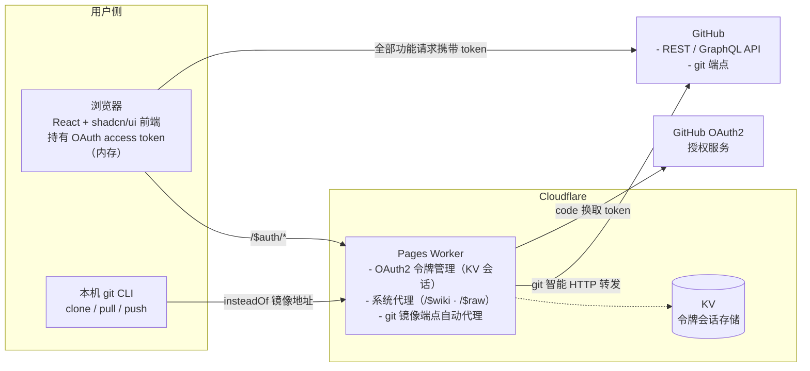
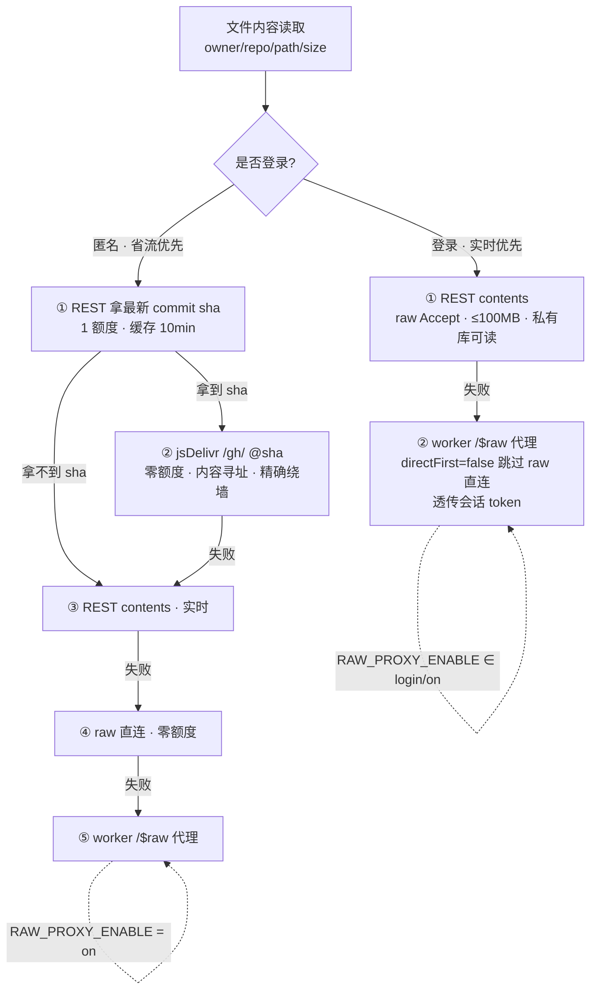

# PureGit 架构设计

> **中心思想**：全量复刻 GitHub 前端（详见 [vision.md](./vision.md)）。本架构服务于该定位——前端承载全部业务，Worker 只做身份与 CLI 代理，数据一律来自官方 API。

## 总体架构



## 组件职责边界

### 前端（`web/`，React + Vite + TS + shadcn/ui）

- 纯 UI 与交互，无业务后端逻辑；全部功能（浏览、搜索、issue/PR、star/fork、私有仓库）均由 OAuth **access token** 完成，请求**直连 GitHub API**；未登录时公开数据匿名直连
- **API 策略**：Octokit SDK 统一封装（`@octokit/graphql` + `@octokit/rest`）；**登录态强制 GraphQL 唯一主通道**（唯一例外 = GraphQL 无适配），smart 函数 = GraphQL 请求模板 + 路径参数变量；**GraphQL 失败 → `withRestFallback` 熔断降级 REST**；**匿名强制 REST**（GraphQL 匿名恒 403）
- **登录态**：token 仅存**内存变量**（刷新经 Worker `/$auth/session` 恢复）；**不写入 localStorage 明文**
- **路由架构（data router）**：`createBrowserRouter` + `RouterProvider`，根 layout 携带 `errorElement` 分类渲染全局错误页（404/限流/5xx）；局部区块错误用 `InlineError`
- **权限体系（双层）**：① **令牌级**（`useAuth`）——`canWrite`（登录 scope 是否「完全控制」模式）及各 scope 维度，由 `WriteGate`/`PermissionGate` 承担门控；② **仓库级**（`useRepoPermission`）——读 repo context 的 `viewer_permission`（ADMIN > MAINTAIN > WRITE > TRIAGE > READ）派生 `canCollaborate`/`canWrite`/`canAdmin` 三档。**写操作双门槛叠加**；匿名/未登录 → 三档全 false（只读浏览）
- **布局**：所有多栏页面统一用 `PageLayout`（三栏模型，left/right 可选）+ 共享常量 `web/src/lib/layout.ts`；组件一律复用 shadcn/ui

### Worker（`worker/`，Cloudflare Pages Worker）

| 职责 | 说明 |
| --- | --- |
| OAuth2 令牌管理 | `/$auth/*` 系列：登录跳转、回调换 token、PAT 直接登录、会话恢复/登出/列表/撤销；`client_secret` 仅存 Worker Secret |
| 会话存储（KV） | access token 存 KV（键 = 会话 id），前端持 httpOnly cookie（会话 id）；会话 TTL 有限期 |
| git 镜像端点自动代理 | 接收 git CLI 流量（info/refs、upload-pack、receive-pack），自动转发至 GitHub 对应端点，支持 clone/pull/push |
| Wiki 内容代理 | `/$wiki/{owner}/{repo}/{page}` —— 服务端 fetch raw wiki（GitHub API 无 wiki 通道，前端直连 raw 受限 → worker 代理） |
| Raw 内容代理 | `/$raw/{owner}/{repo}/{ref}/{path...}` —— 服务端 fetch raw.githubusercontent.com，README 图片/资源降级通道；受 `RAW_PROXY_ENABLE` 开关控制（见「Raw 内容通道」章节） |

**系统路由优先级**：`/$auth`、`/$wiki`、`/$raw`、`/$healthz`、git 端点优先于用户级通配 `/:owner/:repo`；`$` 前缀（GitHub 用户名/仓库名不含 `$`）永不被用户路由占用。**`/$debug` 为纯前端路由**（worker 不参与）。

### CLI 接入（git 镜像端点自动代理）

用户执行一次配置，使本机 git 将 GitHub 地址替换为镜像端点：

```bash
git config --global url.https://<worker域名>/.insteadOf https://github.com/
```

之后 `git clone https://github.com/owner/repo.git` 实际请求 `https://<worker域名>/owner/repo.git`，由 Worker **自动代理**转发到 GitHub。git 凭据使用 **Personal Access Token（PAT）**（push 需要；只读公开仓库无需凭据）。接入细节见 [cli-setup.md](./cli-setup.md)。

## API 模式（登录强制 GraphQL 唯一主通道 + 匿名强制 REST + 熔断降级）

- **GraphQL 唯一主通道**：登录态全部功能经 GraphQL；无「REST 优先」模式选项。路径参数不做字符串拼查询，统一映射为 GraphQL 模板变量
- **文件内容读取例外**：文件原始内容（blob 页 / Raw / 下载 / 编辑页 / DiffView Expand）**去 GraphQL 统一走 REST contents**（GraphQL Blob.text 仅 1MB 且 isTruncated 截断，徒增复杂度）；文件头 commit 信息仍走 GraphQL（Commit.history 无 1MB 限制）。详见「Raw 内容通道」章节
- **匿名强制 REST**（硬约束非降级）：GraphQL 匿名恒 403，匿名时 smart 层短路走 REST 数据层
- **熔断降级**：GraphQL 不可用（网络错误/业务错误/超时/额度耗尽）→ `withRestFallback` 降级链复用 REST 层，日志 `↪` 标记
- **实现载体**：`octokit.ts`（SDK 统一入口 + 额度跟踪 + 熔断）、`api-core.ts`（graphqlRequest + withRestFallback）、`graphql.ts`（模板库）、`api.ts`（smart 封装层）、`rest.ts`（REST 数据层）；页面只调用 `api.ts`，不感知协议

## Raw 内容通道（$raw 后端）设计

> 本节固化文件内容读取（blob 页 / Raw / 下载 / README 资源降级）的**完整通道编排**。
> 中心思想：**登录态实时优先（不动）；匿名态用 jsDelivr 公开 CDN 零额度省流，worker 反代作最后兜底且受开关控制**。

### 1. 通道全景（登录 / 匿名两条链）



**两条链的本质区别**：
- **登录态**：必须保证实时 + 私有仓库可读，因此**不引入 jsDelivr**，最终靠 worker 透传会话 token。
  文件内容读取已去 GraphQL（blob 1MB 截断徒增复杂度），统一走 REST contents 唯一通道。
- **匿名态**：只能访问 public 仓库，天然对齐 jsDelivr 的适用边界；用「零额度 + 精确」的 jsDelivr 替 REST 省流。

### 2. 匿名省流方案：sha 驱动 jsDelivr（内容寻址，精确无滞后）

**关键实测事实**：jsDelivr `/gh/` 通道对 **branch 名（如 `@main`）返回 301 重定向回 `raw.githubusercontent.com`**，并不绕墙；只有 **固定版本（release tag / commit sha）** 才由 jsDelivr 服务器拉取并缓存绕墙。

因此匿名省流必须用 **commit sha** 构造 URL，而非 branch 名：

```
cdn.jsdelivr.net/gh/{owner}/{repo}@{sha}/{path}
```

- **内容寻址**：`@sha` 指向的那个提交就是那个内容——「有则秒回、没有则 jsDelivr 海外服务器去 GitHub 拉取后永久缓存」，**不存在 12h 滞后概念**（拉取动作由海外服务器完成，不被墙）。
- **sha 来源**：`GET /repos/{owner}/{repo}/commits/{branch}`（取 `.sha`，1 次匿名额度，缓存 10min，同仓库多文件共享）。
- **精确性**：sha 天然不可变，替代「24h 时间阈值」等经验性门控——不需要按时间兜底，也无需「对比本地与 jsDelivr 是否同步」。

**收益**：匿名浏览同一仓库时，第 1 个文件之后，10min 内所有文件读取 **0 REST 额度**，且内容精确实时。

### 3. 额度耗尽兜底（匿名额度用尽时）

匿名 REST 额度（60/h）耗尽后，第 ① 步「拿 sha」与第 ③ 步「REST contents」都会失败。此时按 `RAW_PROXY_ENABLE` 分流：

| ENV | 匿名兜底行为 |
|:---:|:---|
| `on` | worker 反代可用 → 走 worker `/$raw`（服务端 fetch raw 绕墙，唯一有效兜底） |
| `off` / `login` | worker 反代不可用 → **无任何可用通道**，直接报错提示「匿名 API 额度已耗尽，请登录后继续」 |

> 说明：jsDelivr 仅 `@sha`/`@tag` 绕墙（branch 名 301 回 raw 撞墙），额度耗尽时拿不到 sha，故无法用 jsDelivr 兜底；`off`/`login` 下匿名额度耗尽即无路可走，只能引导登录。

### 4. 反代开关 `RAW_PROXY_ENABLE`（off / login / on）

worker `/$raw` 与 `/$wiki` 反代是两条链的**最后兜底**，可用性由该 ENV 三段式决定：

| ENV | 登录 worker 兜底 | 匿名 worker 兜底 | 语义 |
|:---:|:---:|:---:|:---|
| `off` | ❌ | ❌ | 完全关闭反代（部署方不承担反代流量） |
| `login` | ✅ | ❌ | 仅登录用户可用反代（匿名不提供，防刷）——**默认** |
| `on` | ✅ | ✅ | 全部放行（兼容旧 `PROXY_ALLOW_ANON="true"`） |

- 前端经 `/$healthz` 下发能力矩阵（`proxies: { mode }`），据此**跳过不可用的 worker 通道**，避免明知关闭还去等超时。
- 语义对齐：`on` = 旧 `PROXY_ALLOW_ANON="true"`；`login` 即「仅对登录有效用户保底」；`off` 为新增「彻底关闭」。

### 5. 运行状态可观测（footer 通道状态灯）

footer 右侧的状态灯由「单一 GitHub API 绿/红点」升级为**具体通道状态**：实时反映当前请求实际命中的服务通道（GitHub GraphQL / GitHub REST / jsDelivr CDN / raw 直连 / Worker 代理），替代原先只标识「GitHub API 可用性」的单一指示灯。

- 数据源：统一请求层（`octokit.ts` + `raw-proxy.ts`）在每次请求命中时写入「最近通道」状态，footer 订阅刷新。
- 目的：让「省流方案实际走了哪条通道」对用户可见，便于理解与排障。

## 关键技术约束

1. **OAuth 回调**：callback URL 指向 Worker（需提前规划开发/生产两套回调）。
2. **令牌管理**：`client_secret` 仅存 Worker Secret；access token 由 Worker 换取后存 KV；**PAT 直接登录**（GitHub 主站受限时绕过授权页）；GitHub OAuth 无 refresh token，token 撤销/过期则重新登录。
3. **会话 cookie**：httpOnly cookie 仅存会话 id（非 token 本身），与 KV 键关联；登出删除 KV 键与 cookie。
4. **git 代理协议**：正确透传 info/refs 的 `service=` 参数、Content-Type、Transfer-Encoding；push 鉴权经 PAT 透传。
5. **CORS**：前端直连 GitHub API 依赖其公开 CORS；Worker OAuth/CLI 端点需处理跨域（同域部署可简化）。
