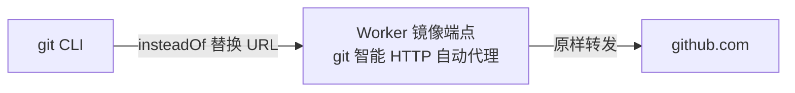

# CLI 接入指南（git 镜像端点）

> 通过一行配置，让本机 git 将 GitHub 流量**自动代理**到 PureGit Worker 镜像端点，
> 解决 `github.com` 直连不稳定问题；clone / pull / push 无需安装任何额外客户端。

## 1. 工作原理



git 智能 HTTP 协议的四个请求均被 Worker 自动转发：

| 请求 | 用途 |
|------|------|
| `GET /owner/repo.git/info/refs?service=git-upload-pack` | fetch / clone 第一步 |
| `GET /owner/repo.git/info/refs?service=git-receive-pack` | push 第一步 |
| `POST /owner/repo.git/git-upload-pack` | fetch 数据 |
| `POST /owner/repo.git/git-receive-pack` | push 数据 |

## 2. 接入配置（一次性）

```bash
git config --global url.https://puregit.deepwn.io/.insteadOf https://github.com/
```

> 生产域名：`puregit.deepwn.io`（Q03 已确认）
> 本地开发：`http://localhost:8787`
> ⚠️ 他人部署：将下面所有 `puregit.deepwn.io` 替换为你自己的部署域名。

效果：所有 `https://github.com/...` 地址自动替换为 `https://puregit.deepwn.io/...`。
之后正常使用 `git clone`、`git pull`、`git push` 即可。

## 3. 鉴权（push 需要）

- **只读（clone / pull 公开仓库）**：无需任何凭据。
- **push（私有仓库或写权限）**：使用 **Personal Access Token（PAT）** 作 git 凭据：

```bash
# 方式 A：URL 内嵌（仅对单个远端）
git clone https://puregit.deepwn.io/owner/repo.git
cd repo
git remote set-url origin https://<user>:<PAT>@puregit.deepwn.io/owner/repo.git

# 方式 B：git 凭据助手（推荐，避免 PAT 明文入 URL）
# Windows：管理器会在首次 push 时提示输入用户名与密码（密码填 PAT）
git config --global credential.helper manager
# Linux/macOS：
git config --global credential.helper store   # 或 cache
```

Worker 将 `Authorization: Basic <user>:<PAT>` **原样透传**给 GitHub，不做存储。

## 4. 验证

```bash
# 查看替换后的远端地址
git config --global --get-regexp 'url\..*\.insteadof'

# 测试连通性（应列出远程分支引用）
git ls-remote https://puregit.deepwn.io/octocat/Hello-World.git

# 完整 clone
git clone https://puregit.deepwn.io/octocat/Hello-World.git
```

## 5. 安全说明

- PAT 仅在请求头中透传，Worker 不落盘、不记录。
- 建议 PAT 使用最小权限（仅 push 所需 repo scope），并设置过期时间。
- 前端 OAuth access token 与 CLI PAT 相互独立。
